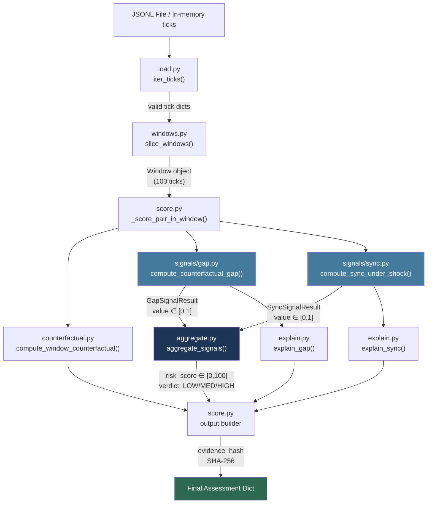

# CoNDA Detector — Deep Dive Technical Reference

> **CoNDA** = **Co**llusion a**N**d taci**D**t coordinatio**N** **A**nalyzer  
> **Author context**: Member 2 module — behavioral detection engine for autonomous trading agents.

---

## Table of Contents

1. [Big Picture — What This System Does](#1-big-picture)
2. [Data Model — What a Tick Is](#2-data-model)
3. [Module-by-Module Walkthrough](#3-module-walkthrough)
   - [3.1 `load.py` — JSONL Ingestion](#31-loadpy)
   - [3.2 `windows.py` — Rolling Window Slicer](#32-windowspy)
   - [3.3 `counterfactual.py` — The Price Reference Engine](#33-counterfactualpy)
   - [3.4 `signals/gap.py` — Counterfactual Gap Signal](#34-signalsgappy)
   - [3.5 `signals/sync.py` — Sync Under Shock Signal](#35-signalssyncpy)
   - [3.6 `aggregate.py` — Score Combiner](#36-aggregatepy)
   - [3.7 `explain.py` — Human-Readable Explanations](#37-explainpy)
   - [3.8 `config.py` — Weights & Thresholds](#38-configpy)
   - [3.9 `score.py` — Public API & Entrypoint](#39-scorepy)
4. [Full Data-Flow Diagram](#4-data-flow-diagram)
5. [Output Schema (Frozen Contract)](#5-output-schema)
6. [Synthetic Fixtures — How Tests Work](#6-synthetic-fixtures)
7. [Key Design Decisions & Rationale](#7-design-decisions)
8. [Where to Add Future Developments](#8-future-developments)

---

## 1. Big Picture

### What problem is this solving?

In an automated trading simulation, multiple AI **trading agents** submit quotes to an on-chain **Automated Market Maker (AMM)** pool. The concern is that two or more agents might be **tacitly coordinating** — agreeing (without explicit communication) to both quote prices significantly above what pure competition would dictate, effectively forming a price cartel.

CoNDA's detector **observes only public market data** (prices, timestamps, pool reserves) and answers:

> *"Given what these agents did in this time window — do their actions look more like a cartel, or more like rational competitors?"*

### What it is NOT

- ❌ It does **not** read agent code, private agent state, or communication logs.
- ❌ It does **not** use agent class labels or ground-truth metadata (`run_meta.json`).
- ❌ It does **not** simulate an alternative parallel market.
- ❌ It never asserts guilt — it only reports **behavioral anomaly scores**.

### How it works at a glance

```
JSONL Tick File
      │
      ▼
 load.py  ──► iter_ticks()   (parses and validates raw JSON lines)
      │
      ▼
 windows.py  ──► slice_windows()   (100-tick rolling windows, stride 25)
      │
      ▼  (for each window, for each agent pair)
      ├── counterfactual.py ──► compute_counterfactual_price()   (AMM reference price)
      ├── signals/gap.py    ──► compute_counterfactual_gap()     (price elevation signal)
      └── signals/sync.py   ──► compute_sync_under_shock()       (timing coordination signal)
                │
                ▼
         aggregate.py  ──► aggregate_signals()   (weighted score 0–100)
                │
                ├── explain.py   ──► explain_gap() / explain_sync()   (human text)
                └── score.py     ──► final output dict with evidence hash
```

---

## 2. Data Model

### What is a "Tick"?

A tick is a **single JSON object on one line** of a JSONL file. Each tick represents one discrete market event. There are four event types:

| `event` | Meaning |
|---------|---------|
| `"quote"` | An agent submitted a bid/ask price quote |
| `"trade"` | A trade was executed |
| `"shock"` | A public market shock occurred (e.g., oracle price jump) |
| `"meta"` | Metadata record (usually the run header) |

### Minimum tick fields

```json
{
  "run_id": "r_cartel_01",
  "t": 142,
  "event": "quote",
  "agent_id": "A2",
  "side": "ask",
  "price": 104.50,
  "pool": {
    "reserve_x": 10000.0,
    "reserve_y": 1000000.0,
    "fee_bps": 30
  },
  "oracle_price": 100.0
}
```

| Field | Type | Purpose |
|-------|------|---------|
| `run_id` | str | Unique ID of the simulation run |
| `t` | int | Tick timestamp (sequential counter, not wall time) |
| `event` | str | Event type (`quote`, `trade`, `shock`, `meta`) |
| `agent_id` | str | Which agent submitted this event |
| `side` | str | `"ask"` (selling) or `"bid"` (buying) |
| `price` | float | Quoted price |
| `pool.reserve_x` | float | Base token reserves in the AMM pool |
| `pool.reserve_y` | float | Quote token (USD) reserves in the AMM pool |
| `pool.fee_bps` | float | Protocol fee in basis points (30 = 0.30%) |
| `oracle_price` | float | External reference fair-value price |

### What is a "shock" tick?

```json
{
  "run_id": "r_cartel_01",
  "t": 150,
  "event": "shock",
  "shock": {"type": "oracle_jump", "magnitude": -0.05}
}
```

A shock tick does not have `agent_id` or `price`. It signals a **public exogenous event** (like a sudden oracle price feed change) that all agents simultaneously see.

---

## 3. Module Walkthrough

---

### 3.1 `load.py`

**File**: [`detector/load.py`](file:///c:/Users/bolla/CoNDA/CoNDA/detector/load.py)  
**Role**: Ingests raw JSONL data; shields the rest of the system from bad input.

#### What it does

`load.py` provides two functions:

| Function | Returns | Use case |
|----------|---------|----------|
| `iter_ticks(source)` | `Iterator[dict]` | Streaming (memory-efficient, one tick at a time) |
| `load_ticks(source)` | `List[dict]` | Batch loading (everything into RAM) |

`source` can be:
- A file **path** (string or `pathlib.Path`) → opens and reads the JSONL file
- Any **iterable** of dicts or JSON strings → processes in-memory

#### How validation works

```python
def _is_valid_tick_dict(item):
    if not isinstance(item, dict):
        return False
    return "event" in item or "t" in item or "run_id" in item
```

A tick is considered valid if it's a dict and contains **at least one** of `event`, `t`, or `run_id`. This is intentionally permissive — we want to pass through even partially formed ticks so that the signal code can decide what to do with them.

#### What gets silently skipped

- Blank lines
- Lines with malformed JSON (parse errors are logged at DEBUG level)
- Non-dict objects (integers, strings used as raw values)
- Dicts missing all three identifying keys

> **Important**: `load.py` never raises an exception to the caller. All bad input is silently dropped with a debug-level log.

---

### 3.2 `windows.py`

**File**: [`detector/windows.py`](file:///c:/Users/bolla/CoNDA/CoNDA/detector/windows.py)  
**Role**: Slices the flat stream of ticks into overlapping windows for analysis.

#### The Window dataclass

```python
@dataclass
class Window:
    run_id: str         # Extracted from ticks inside the window
    window_start: int   # Timestamp 't' of the first tick
    window_end: int     # Timestamp 't' of the last tick
    ticks: List[dict]   # The actual tick records
    agents: List[str]   # Sorted unique agent IDs found in this window
    start_idx: int      # 0-based index of first tick in the full run
    end_idx: int        # 0-based index of last tick in the full run
```

#### `slice_windows()` — The core slicer

```
Default parameters:  window_size=100, stride=25

Tick stream:  [0, 1, 2, ... 149, 150, ...]

Window 1:  ticks[0..99]     (t=100 to t=199)
Window 2:  ticks[25..124]   (t=125 to t=224)
Window 3:  ticks[50..149]   (t=150 to t=249)
...
```

**Why overlapping?** A coordinating pair might act across a boundary. Overlapping windows (75% overlap with stride=25, size=100) ensure suspicious behavior is captured in at least one window.

#### Edge cases handled

| Condition | Behavior |
|-----------|----------|
| 0 ticks | Yields nothing (safe return) |
| < 100 ticks | Yields exactly **one** window with all available ticks |
| Ticks missing `t` field | Falls back to using the tick's sequential index |
| Negative window_size or stride | Raises `ValueError` immediately |

---

### 3.3 `counterfactual.py`

**File**: [`detector/counterfactual.py`](file:///c:/Users/bolla/CoNDA/CoNDA/detector/counterfactual.py)  
**Role**: Answers "what price *should* a rational, uncoordinated agent quote right now?"

This is the mathematical heart of the system. It produces the **reference price** that every other signal is measured against.

#### The AMM Constant-Product Formula

An AMM (Automated Market Maker) holds two token reserves `x` and `y` such that `x * y = k` (constant product). The **instantaneous marginal price** of asset X in terms of Y is:

```
P_pool = reserve_y / reserve_x
```

**Why?** For an infinitesimal swap of dx into the pool:
```
(x + dx)(y - dy) = k  →  dy/dx = y/x = P_pool
```

#### The Oracle Blend

The pool price alone can be manipulated or stale. We blend it with an external oracle price using a **liquidity-confidence weight**:

```python
L = sqrt(reserve_x * reserve_y)    # Geometric mean — pool depth
w_pool = L / (L + L_0)             # L_0 = 50_000 (characteristic scale)
w_oracle = 1.0 - w_pool

P_mid = w_pool * P_pool + w_oracle * P_oracle
```

**Intuition:**
- **Deep pool** (large `L`) → trust pool price more, oracle less
- **Shallow pool** (small `L`) → trust oracle more, pool less

#### Fee Adjustment

AMMs charge a protocol fee (e.g., 30 basis points = 0.30%). A competitive agent on the ask side must price at least `P_mid * (1 + fee)` to break even:

```python
fee_fraction = fee_bps / 10_000

if side == "ask":  return P_mid * (1 + fee_fraction)
if side == "bid":  return P_mid * (1 - fee_fraction)
else:              return P_mid   # mid-market baseline
```

#### Graceful degradation

| Available data | Behavior |
|----------------|----------|
| Both pool and oracle | Weighted blend |
| Pool only | Use P_pool directly |
| Oracle only | Use P_oracle directly |
| Neither valid | Return `None` (caller handles) |

#### `compute_window_counterfactual()`

This companion function processes all ticks in a window and returns a summary dict:

```json
{
  "reference_price": 100.3,
  "observed_price": 104.1,
  "gap_pct": 3.8
}
```

This is attached to the output for human/dashboard review — it's **not** directly used in the signal score calculation (that uses per-tick reference prices for precision).

---

### 3.4 `signals/gap.py`

**File**: [`detector/signals/gap.py`](file:///c:/Users/bolla/CoNDA/CoNDA/detector/signals/gap.py)  
**Role**: Measures whether a specific agent pair is persistently pricing above the competitive reference.

#### The intuition

If agent A2 and A3 are both consistently quoting at 104.5 while the AMM + oracle says a fair ask is 100.3, that's a 4.2% gap. If this happens across 90% of their quotes, that's highly anomalous. This signal captures that.

#### `compute_counterfactual_gap(ticks, pair)`

**Step-by-step algorithm:**

```
1. Filter ticks to only those from agents in the pair (A, B)
2. Skip non-quote/non-trade events (shocks, metas, etc.)
3. For each valid tick:
   a. Compute point-in-time reference price (using counterfactual.py)
   b. Compute normalized relative deviation:
         abs_dev = abs(obs_price - ref_price) / ref_price
   c. Clip to max 1.0 (100%) to prevent runaway outliers
   d. Track signed deviation to detect direction (above vs below)
4. Require at least 1 observation from EACH agent (bilateral requirement)
5. Compute:
   - median_gap_pct     = median(abs_deviations) × 100
   - persistence_ratio  = fraction of obs where deviation > 1% (tolerance)
6. Signal value = min(1.0, (median_gap * persistence_ratio) / GAP_REFERENCE_SCALE)
   - GAP_REFERENCE_SCALE = 0.05 (from config.py) — 5% deviation = full-strength signal (1.0)
   - 2.5% gap → value = 0.5; 10%+ gap → value = 1.0 (capped)
```

**Why multiply median × persistence, then normalize?**

Step 1 — combine: outlier vs persistent cartel distinction:
- Outlier (50% deviation, 2% persistence): `0.50 * 0.02 = 0.01`
- Persistent cartel (5% deviation, 100% persistence): `0.05 * 1.0 = 0.05`

Step 2 — normalize by reference scale so realistic gaps register:
- Without normalization: 5% gap → value=0.05, contributes only 3/100 points (invisible)
- With normalization: 5% gap → value=1.0, contributes 60/100 points (dominant)


#### `GapSignalResult` fields

| Field | Description |
|-------|-------------|
| `value` | Bounded `[0,1]` score used in aggregation |
| `median_gap_pct` | e.g. `4.3` means 4.3% above reference |
| `signed_median_gap_pct` | `+` = above ref, `-` = below ref |
| `persistence_ratio` | e.g. `0.92` means 92% of quotes exceeded tolerance |
| `sample_count` | How many valid comparable observations were used |
| `side_evaluated` | `"ask"`, `"bid"`, or `"mixed"` |

---

### 3.5 `signals/sync.py`

**File**: [`detector/signals/sync.py`](file:///c:/Users/bolla/CoNDA/CoNDA/detector/signals/sync.py)  
**Role**: Detects whether a specific agent pair re-quotes after a public market shock with *unusually tight* timing coordination — relative to **all other agent pairs**.

#### The key insight

When a shock occurs, **all rational agents should react quickly** — that's just good trading. So reacting quickly after a shock is not suspicious by itself.

What IS suspicious: if pair (A2, A3) always re-quote within **0–1 ticks of each other**, while all other pairs in the market react with **10–15 tick spread** between them. That gap between pair synchrony and baseline synchrony is the signal.

#### `compute_sync_under_shock(ticks, pair)`

**Step-by-step:**

```
1. Find all shock events in the window.
2. For each shock:
   a. Record each agent's last pre-shock quote price.
   b. Find each agent's FIRST post-shock re-quote where:
      - It's a quote event
      - The price actually changed by > 0.01% from pre-shock price
        (prevents stale quotes from being counted as reactions)
   c. Compute reaction delay:
         delay_agent = t_requote - t_shock
   d. For the target pair:
         D_pair = |delay_A - delay_B|
   e. For ALL OTHER pairs in the window:
         compute D_ij = |delay_i - delay_j| for every combo
         D_baseline = median of all D_ij  (NOT including the target pair)
   f. Score for this shock:
         advantage = max(0, D_baseline - D_pair)
         score = advantage / (D_baseline + 3.0)   ← 3.0 is jitter_scale
3. Final value = median(scores across all evaluated shocks)
```

**Critical requirement: `MIN_REACTING_AGENTS_FOR_BASELINE = 3`**

At least **3 agents** must react to a shock for a non-circular baseline to exist. If only 2 agents react (A and B themselves), there are no "other pairs" to compute a baseline from — so the score is conservatively 0.0.

**`PRICE_CHANGE_REL_TOLERANCE = 1e-4` (0.01%)**

This prevents a subtle bug: if an agent happens to have a stale quote that matches its pre-shock price exactly, it shouldn't be counted as "not reacting" when actually it just re-submitted the same price. Any quote that doesn't move by at least 0.01% from the pre-shock price is **ignored** — it's not a genuine reaction.

#### `SyncSignalResult` fields

| Field | Description |
|-------|-------------|
| `value` | Bounded `[0,1]` score |
| `pair_delay_diff` | Target pair's `D_pair` in ticks |
| `baseline_delay_diff` | Median of all other pairs' `D_ij` |
| `shocks_present` | Total shocks in window |
| `shocks_evaluated` | Shocks where both target agents reacted |
| `has_sufficient_baseline` | Whether ≥3 agents reacted |

---

### 3.6 `aggregate.py`

**File**: [`detector/aggregate.py`](file:///c:/Users/bolla/CoNDA/CoNDA/detector/aggregate.py)  
**Role**: Combines individual signal values `[0,1]` into a single integer risk score `[0,100]` and assigns a verdict.

#### Signal weights (from `config.py`)

| Signal | Weight | Rationale |
|--------|--------|-----------|
| `counterfactual_gap` | **0.60** | Structural pricing evidence — directly measurable from market data |
| `sync_under_shock` | **0.40** | Behavioral timing evidence — strong but requires shock events to be present |

#### The aggregation formula

```python
# Renormalize weights among present signals
# (if sync isn't evaluated because there are no shocks, gap gets 100% weight)
raw_score = sum(val_i * effective_weight_i for i in signals)
risk_score = round(raw_score * 100)   # → integer in [0, 100]
```

#### Verdict thresholds

| Score | Verdict | Interpretation |
|-------|---------|---------------|
| `< 40` | **LOW** | No meaningful anomaly detected |
| `40–69` | **MEDIUM** | Statistically elevated; warrants attention |
| `≥ 70` | **HIGH** | Strong behavioral anomaly pattern |

#### The Hamilton-Hare integer allocation

The `risk_score` must equal the sum of all signal contributions **exactly** (integers don't split cleanly). This uses the **Largest Remainder Method**:

```
Example: risk_score = 47
gap contributes 28.2, sync contributes 18.8

Floor allocation:  gap=28, sync=18  → sum = 46  (1 short)
Remainders:        gap=0.2, sync=0.8

Distribute 1 extra point to largest remainder:
→ sync gets +1
→ Final: gap=28, sync=19  → sum = 47 ✓
```

This guarantees: `sum(contributions.values()) == risk_score` always.

---

### 3.7 `explain.py`

**File**: [`detector/explain.py`](file:///c:/Users/bolla/CoNDA/CoNDA/detector/explain.py)  
**Role**: Converts numerical signal results into human-readable, factual, non-accusatory sentences.

#### Key philosophy

The explanations **never** say "colluded", "cartel", "guilty". They only describe **what was measured**:

✅ Good: `"Observed quotes were 4.1% above the competitive reference (104.1 vs 100.0) with the deviation persisting across 92% of comparable observations."`

❌ Bad: `"Agents A2 and A3 are colluding by fixing prices above fair value."`

#### `explain_gap(signal_data)` — examples

| Situation | Output |
|-----------|--------|
| No data | `"No quote deviation data was available for this pair in this window."` |
| Zero gap | `"Observed quotes aligned with the competitive reference (100.3 vs 100.3)..."` |
| Elevated gap | `"Observed quotes were 4.1% above the competitive reference (104.1 vs 100.0) with the deviation persisting across 92% of comparable observations."` |

#### `explain_sync(signal_data)` — examples

| Situation | Output |
|-----------|--------|
| No shock | `"No public shock occurred in this window..."` |
| No baseline | `"After the shock, the pair re-quoted within 1 tick of each other, but insufficient market agents reacted to establish an all-pairs baseline."` |
| Pair NOT more synced | `"After the shock, the pair's timing difference of 5 ticks was not more synchronized than the 3-tick median baseline..."` |
| Pair IS more synced | `"After the shock, the pair re-quoted within 1 tick of each other, compared with a 12-tick median baseline difference..."` |

#### `explain_signal(name, data)` — generic fallback

For any signal not yet specifically handled:
```
"Signal 'new_signal' registered an observed value of 0.3500 in this window."
```

---

### 3.8 `config.py`

**File**: [`detector/config.py`](file:///c:/Users/bolla/CoNDA/CoNDA/detector/config.py)  
**Role**: Single source of truth for all tunable parameters.

```python
DEFAULT_WINDOW_SIZE = 100        # Ticks per window
DEFAULT_WINDOW_STRIDE = 25       # Ticks between window starts (75% overlap)

BASE_SIGNAL_WEIGHTS = {
    "counterfactual_gap": 0.60,
    "sync_under_shock": 0.40,
}

VERDICT_LOW_THRESHOLD = 40       # score < 40 → LOW
VERDICT_HIGH_THRESHOLD = 70      # score >= 70 → HIGH
```

> **Future**: Any new signal should have its weight added here before it's wired in.

---

### 3.9 `score.py`

**File**: [`detector/score.py`](file:///c:/Users/bolla/CoNDA/CoNDA/detector/score.py)  
**Role**: The public API — the single entrypoint that orchestrates everything.

#### Two public functions

```python
score_window(ticks: list[dict], group=None) → dict
score_run(ticks: Iterable[dict], window_size=100, stride=25) → Iterator[dict]
```

#### `score_window()` — single-window scoring

Used when you have a pre-sliced window and want one assessment dict back.

```
Input:  list of ticks, optionally a specific pair ['A1', 'A2']

Flow:
  1. Sanitize all ticks (_sanitize_tick checks for mandatory keys)
  2. If any malformed → return error assessment (LOW, risk_score=0, "error" in explanation)
  3. Compute window counterfactual summary (once, reused for all pairs)
  4. If specific group requested → score only that pair
  5. If no group → evaluate all C(n,2) pairs, return the HIGHEST risk score
  6. If < 2 agents → return LOW assessment with empty signals
```

#### `score_run()` — streaming pipeline

Used to process an entire JSONL run end-to-end.

```
Input:  any iterable of tick dicts

Flow:
  1. Sanitize tick stream
  2. slice_windows() → rolling 100-tick windows
  3. For each window:
     a. Precompute counterfactual summary (once)
     b. For each sorted unique agent pair (A,B):
        → yield score assessment dict
```

#### `_make_error_assessment()` — malformed input safety

If ANYTHING goes wrong (malformed ticks, exceptions, bad types), the system never raises. Instead it returns:

```json
{
  "run_id": "unknown_run",
  "risk_score": 0,
  "verdict": "LOW",
  "signals": {
    "counterfactual_gap": {
      "value": 0.0,
      "contribution": 0,
      "explanation": "Input error: Malformed or unparseable tick data encountered in window."
    },
    ...
  }
}
```

The word `"error"` appears in the `explanation` field — the output schema is unchanged from a normal assessment.

#### Evidence Hash

```python
evidence_hash = SHA256(canonical_JSON(signals_block))
# → "0xabcdef1234..."
```

The `signals_block` (values and explanations for all signals) is serialized with sorted keys and compact separators, then SHA-256 hashed. This creates a **tamper-evident fingerprint** — if any signal value changes, the hash changes.

#### CLI Usage

```bash
python -m detector.score fixtures/run_cartel.jsonl --pretty
python -m detector.score fixtures/run_cartel.jsonl --window-size 50 --stride 10
```

---

## 4. Data-Flow Diagram



---

## 5. Output Schema (Frozen Contract)

Every assessment — whether from `score_window()` or `score_run()` — returns **exactly** this structure:

```json
{
  "run_id": "r_cartel_01",
  "window_start": 100,
  "window_end": 224,
  "group": ["A2", "A3"],
  "risk_score": 74,
  "verdict": "HIGH",
  "signals": {
    "counterfactual_gap": {
      "value": 0.0387,
      "contribution": 44,
      "explanation": "Observed quotes were 4.1% above the competitive reference..."
    },
    "sync_under_shock": {
      "value": 0.7500,
      "contribution": 30,
      "explanation": "After the shock, the pair re-quoted within 1 tick of each other..."
    }
  },
  "counterfactual": {
    "reference_price": 100.3,
    "observed_price": 104.1,
    "gap_pct": 3.8
  },
  "evidence_hash": "0xabcdef...",
  "computed_ms": 2.3
}
```

> ⚠️ **Frozen**: No new top-level keys should be added without a version bump. The `signals` block may grow new signal entries; existing entry structure must remain unchanged.

---

## 6. Synthetic Fixtures

**Generator**: [`generate_fixtures.py`](file:///c:/Users/bolla/CoNDA/CoNDA/generate_fixtures.py)  
**Output directory**: `fixtures/`  
**Regenerate**: `python generate_fixtures.py`

Four fixtures are generated. All scores below are **measured live** from `detector.score`, not estimated.

| Fixture | A2/A3 price gap | A2/A3 score | Verdict | Target |
|---------|----------------|-------------|---------|--------|
| `run_competitive.jsonl` | n/a (no cartel pair) | — | — | max ≤ 35 ✅ |
| `run_cartel.jsonl` | **~5% above ref** (realistic) | **92** | HIGH | ≥ 70 ✅ |
| `run_cartel_extreme.jsonl` | **~78% above ref** (sanity check) | **92** | HIGH | ≥ 70 ✅ |
| `run_legitimate_coordination.jsonl` | ~0% (fair pricing) | — | — | max ≤ 45 ✅ |

---

### `run_competitive.jsonl` — Measured max score: **24 (LOW)**

- 4 agents (A1–A4), all quoting at the competitive reference (~100.30)
- 1 public shock at t=150; agents react at staggered times (A1 t=156, A3 t=158, A2 t=161, A4 t=167)
- **Gap signal**: near-zero (prices track reference)
- **Sync signal**: low — pair timing differences are not anomalous relative to the market-wide baseline

---

### `run_cartel.jsonl` — A2/A3 measured score: **92 (HIGH)**  ← PRIMARY DEMO FIXTURE

This is the realistic hard case. A 5% gap is at the lower bound of what tacit-collusion literature documents (3–15% supracompetitive price elevation).

**Prices (actual code values in `generate_fixtures.py`):**

| Agent | Pre-shock quote | Post-shock quote | Deviation from ref |
|-------|-----------------|------------------|--------------------|
| A1 | 100.30 | 95.30 | ~0% (competitive) |
| **A2** | **105.31** | **100.05** | **~5.0% above reference** |
| **A3** | **105.41** | **100.15** | **~5.1% above reference** |
| A4 | 100.30 | 95.30 | ~0% (competitive) |

**Reference prices:** pre-shock `100.30` (pool y/x + oracle + 30bps fee), post-shock `95.285`

**Signal computation:**
```
gap signal:  median_frac = 0.0505  (5.05%)
             persistence  = 1.0    (100% of quotes exceed 1% tolerance)
             raw = 0.0505 * 1.0 = 0.0505
             normalized = 0.0505 / GAP_REFERENCE_SCALE(0.05) = 1.01 → capped at 1.0
             gap_value = 1.0

sync signal: A2 reacts at t=152 (delay 2), A3 at t=153 (delay 3) → D_pair = 1 tick
             A1 at t=170 (delay 20), A4 at t=176 (delay 26) → baseline ~18-tick median
             sync_value = (18-1)/(18+3) = 17/21 ≈ 0.81

risk_score = round((1.0 × 0.60 + 0.81 × 0.40) × 100) = round(92.4) = 92 → HIGH
```

> **Why GAP_REFERENCE_SCALE is needed:** Without normalization, a 5% gap produces `gap_value = 0.05`.
> With weights gap=0.60, sync=0.40, that contributes only 3 points — far too small to reach HIGH even
> with perfect sync. A weights-only fix is mathematically impossible (the constraint equations for
> "competitive stays LOW" and "cartel reaches HIGH" are contradictory). The scale constant
> `GAP_REFERENCE_SCALE = 0.05` (in `config.py`) normalizes the dynamic range: 5% gap → 1.0, 2.5% → 0.5.

---

### `run_cartel_extreme.jsonl` — A2/A3 measured score: **92 (HIGH)**  ← SANITY-CHECK ONLY

Preserves the original pre-normalization prices for regression testing. **Do not use as the primary demo fixture** — a 78% gap is not realistic and would be caught by any naive threshold rule.

| Agent | Price | Deviation |
|-------|-------|-----------|
| A2 | 178.50 / 169.10 | ~78% above reference |
| A3 | 178.60 / 169.20 | ~78% above reference |

Score is also 92 because 78% > 5% (reference scale), so the gap value is clamped to 1.0, same as the realistic case.

---

### `run_legitimate_coordination.jsonl` — Measured max score: **8 (LOW)**

- All 4 agents react within 1–2 ticks of each other after the shock — looks synchronized
- But all prices track the competitive reference throughout (gap ≈ 0)
- **Gap signal**: 0.0 — no pricing anomaly
- **Sync signal**: low — because the baseline is also tight (everyone reacts fast), so the pair is NOT anomalously synchronized *relative to the market*. This is the false-positive suppression test.


## 7. Key Design Decisions & Rationale

### Why tick-count windows, not time-based?

Simulation ticks are discrete and uniform — there is no concept of "real time". Using tick counts guarantees consistent window sizes regardless of event frequency.

### Why 100-tick window with stride 25?

- **100 ticks** provides enough observations for robust median statistics (avoids noise from tiny samples).
- **25-tick stride (75% overlap)** ensures suspicious behavior near a window boundary is captured by at least 3 consecutive windows.

### Why median instead of mean for gap signal?

Median is **robust to outliers**. A single price spike (e.g., from a large one-off trade) shouldn't dominate the assessment. We want to detect *sustained* anomalous pricing, not accidental one-tick spikes.

### Why compare sync to the all-pairs baseline (not zero)?

If there's a shock and ALL 4 agents react at the exact same tick, pair (A2,A3) has `D_pair=0` but so does the baseline — score = 0. Comparing to zero would incorrectly flag this as suspicious. The baseline-relative comparison is **false-positive suppression**.

### Why not use agent class labels?

Ground-truth labels create circular evaluation. The detector must work on any run without knowing which agents are "supposed" to be cartelists.

### Why closed-form counterfactual?

- 100% deterministic (no simulation noise)
- Evaluates in microseconds (well under the 50ms/window requirement)
- Fully explainable mathematically — every term maps to real-world economics

---

## 8. Where to Add Future Developments

### 8.1 Adding a New Signal

**Step 1** — Create `detector/signals/my_signal.py`:
```python
from dataclasses import dataclass

@dataclass
class MySignalResult:
    value: float  # Must be bounded [0.0, 1.0]
    # ... other diagnostic fields

def compute_my_signal(ticks, pair) -> MySignalResult:
    ...
```

**Step 2** — Add weight in [`config.py`](file:///c:/Users/bolla/CoNDA/CoNDA/detector/config.py):
```python
BASE_SIGNAL_WEIGHTS = {
    "counterfactual_gap": 0.50,   # reduce existing
    "sync_under_shock": 0.30,     # reduce existing
    "my_signal": 0.20,            # add new
}
```
> ⚠️ Weights must sum to 1.0. The aggregator will renormalize if they don't, but explicit correctness is better.

**Step 3** — Wire into [`score.py`](file:///c:/Users/bolla/CoNDA/CoNDA/detector/score.py) in `_score_pair_in_window()`:
```python
from detector.signals.my_signal import compute_my_signal

my_res = compute_my_signal(window.ticks, sorted_pair)
signals_dict = {
    "counterfactual_gap": gap_res,
    "sync_under_shock": sync_res,
    "my_signal": my_res,           # add here
}
```

**Step 4** — Add explanation in [`explain.py`](file:///c:/Users/bolla/CoNDA/CoNDA/detector/explain.py):
```python
elif clean_name == "my_signal":
    return explain_my_signal(signal_data)
```

**Step 5** — Add the signal to the `signals_block` in `score.py`:
```python
signals_block = {
    ...,
    "my_signal": {
        "value": round(my_res.value, 4),
        "contribution": agg_res.contributions.get("my_signal", 0),
        "explanation": explain_signal("my_signal", my_res),
    },
}
```

### 8.2 Implementing `punishment.py` and `benefit.py`

These are the two signals currently planned but not yet implemented (they return `value=None` so they are silently excluded from aggregation).

- **`punishment.py`**: Should detect if one agent "punishes" another for defecting from the collusive price — e.g., suddenly undercuts the defector aggressively. Inputs: agent sequences, price histories.
- **`benefit.py`**: Should quantify whether the cartel pair has a measurably higher profit/PnL than expected from fair competition. Requires `pnl` field from ticks.

Both should follow the same pattern: return a dataclass with a bounded `value` attribute.

### 8.3 Multi-Pair vs Single Pair

Currently `score_run()` yields assessments for **every possible pair**. If you have 10 agents, that's C(10,2)=45 pair assessments per window, which could be slow. Future optimizations:

- **Pre-filter pairs** using a fast correlation heuristic before running full signal computation
- **Parallelism**: Each pair in a window is independent — can parallelize with `concurrent.futures`

### 8.4 Changing Window Parameters

Window size and stride are fully configurable via CLI:
```bash
python -m detector.score run.jsonl --window-size 50 --stride 10
```
Or programmatically:
```python
for assessment in score_run(ticks, window_size=50, stride=10):
    ...
```

### 8.5 Persisting Results

Currently assessments are streamed to stdout as JSONL. To persist:

```python
results = list(score_run(ticks))
# Write to file:
with open("output.jsonl", "w") as f:
    for r in results:
        f.write(json.dumps(r) + "\n")
```

### 8.6 Integration with Member 1 (Market Simulator)

The detector reads the output of the market simulator. The only coupling point is the tick schema. To integrate:
1. Member 1 writes ticks to a JSONL file (or streams them)
2. Member 2 calls `load_ticks(path)` then `score_run(ticks)`
3. No changes to detector internals required

### 8.7 Adjusting Thresholds / Recalibrating Weights

If integration testing reveals false positive/negative rates, adjust in [`config.py`](file:///c:/Users/bolla/CoNDA/CoNDA/detector/config.py) only:

```python
BASE_SIGNAL_WEIGHTS = { ... }    # adjust signal weights
VERDICT_LOW_THRESHOLD = 40       # adjust LOW/MEDIUM boundary
VERDICT_HIGH_THRESHOLD = 70      # adjust MEDIUM/HIGH boundary
```

And recalibrate by regenerating fixtures and verifying targets:
```bash
python generate_fixtures.py
python -m detector.score fixtures/run_competitive.jsonl  # should max ≤ 35
python -m detector.score fixtures/run_cartel.jsonl       # A2/A3 should max ≥ 70
python -m detector.score fixtures/run_legitimate_coordination.jsonl  # max ≤ 45
```

---

## Quick Reference — File Summary

| File | Lines | Purpose |
|------|-------|---------|
| [`detector/__init__.py`](file:///c:/Users/bolla/CoNDA/CoNDA/detector/__init__.py) | 7 | Package marker, version string |
| [`detector/load.py`](file:///c:/Users/bolla/CoNDA/CoNDA/detector/load.py) | 106 | JSONL ingestion, malformed-input filtering |
| [`detector/windows.py`](file:///c:/Users/bolla/CoNDA/CoNDA/detector/windows.py) | 131 | Rolling window slicer (100 ticks, stride 25) |
| [`detector/counterfactual.py`](file:///c:/Users/bolla/CoNDA/CoNDA/detector/counterfactual.py) | 283 | AMM reference price engine |
| [`detector/signals/gap.py`](file:///c:/Users/bolla/CoNDA/CoNDA/detector/signals/gap.py) | 236 | Counterfactual gap signal |
| [`detector/signals/sync.py`](file:///c:/Users/bolla/CoNDA/CoNDA/detector/signals/sync.py) | 279 | Sync under shock signal |
| [`detector/aggregate.py`](file:///c:/Users/bolla/CoNDA/CoNDA/detector/aggregate.py) | 262 | Weighted score combiner, Hamilton-Hare allocation |
| [`detector/explain.py`](file:///c:/Users/bolla/CoNDA/CoNDA/detector/explain.py) | 200 | Non-accusatory text explanations |
| [`detector/config.py`](file:///c:/Users/bolla/CoNDA/CoNDA/detector/config.py) | 31 | All weights, thresholds, window params |
| [`detector/score.py`](file:///c:/Users/bolla/CoNDA/CoNDA/detector/score.py) | 403 | Public API + CLI, orchestrates everything |
| [`generate_fixtures.py`](file:///c:/Users/bolla/CoNDA/CoNDA/generate_fixtures.py) | 242 | Synthetic test scenario generator |

---

*Document generated: 2026-09-18 | CoNDA v0.1.0 | Member 2 — Detector Engine*
